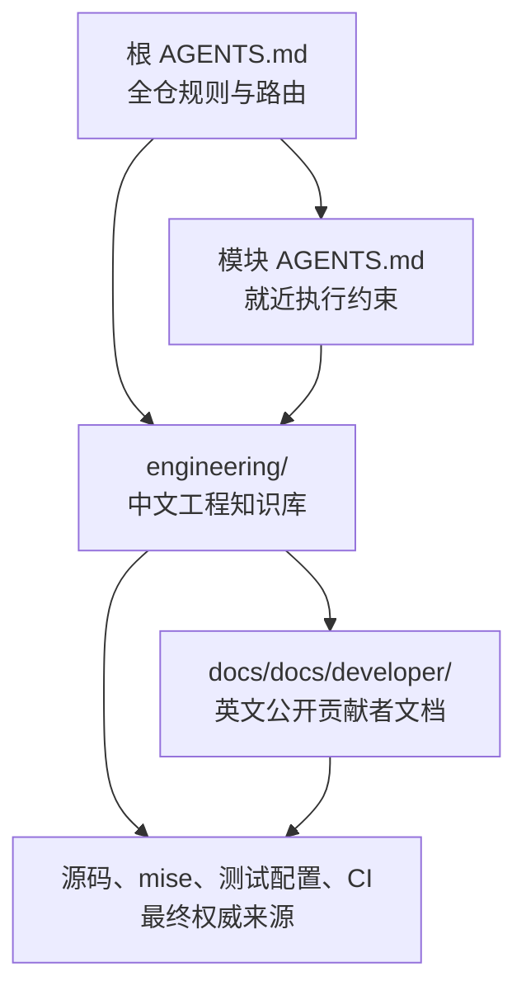

# Immich 分层工程文档体系设计

> 状态：设计方案已确认并实施  
> 日期：2026-08-11  
> 核对基线：`11fe6db14e06a258020cf4ac3c34f35243429d96`  
> 文档语言：中文为主，代码标识、命令及通用技术术语保留英文

## 1. 背景

Immich 是一个跨语言、跨运行时的 monorepo，主要包含：

- NestJS/Express/PostgreSQL/BullMQ 后端；
- SvelteKit/Svelte Web 客户端；
- Flutter/Dart 移动客户端及 Android/iOS 原生集成；
- Python/FastAPI/ONNX Machine Learning 服务；
- OpenAPI、SDK、CLI、plugin、i18n、共享 UI/设计资源、E2E 和 Docker 基础设施。

仓库已经有面向公开贡献者的英文文档 `docs/docs/developer/`，也有深度不一的模块 README，但尚无 `AGENTS.md`。现有文档还存在部分与当前源码不一致的内容，例如 Mobile 已使用 Drift/SQLite，而部分架构说明仍引用 Isar；因此新的工程文档不能简单复制既有说明，必须明确权威来源与核对基线。

## 2. 目标

建立一套同时服务人类开发者与 AI coding agent 的分层文档体系，使后续开发能够快速回答：

1. 系统由哪些运行组件组成，它们如何交互？
2. 每个模块的职责、边界、技术栈和关键数据流是什么？
3. 一项修改应从哪里开始，会联动哪些生成物、迁移和测试？
4. 不同模块应运行哪些最低验证命令？
5. 哪些内容属于公开上游文档，哪些属于本地工程知识？
6. 如何防止版本、命令、架构描述和 scoped instructions 随代码演进而漂移？

## 3. 非目标

本次工作不包含：

- 修改业务代码、依赖或运行时配置；
- 重构现有 `docs/docs/developer/` 信息架构；
- 将中文工程知识库发布到 Docusaurus 站点；
- 替代 `CONTRIBUTING.md`、CI 配置、`mise.toml` 或源码本身；
- 把 Graphify 产物作为长期权威来源；
- 为所有子目录机械地创建 `AGENTS.md`。

## 4. 已考虑的方案

| 方案       | 优点                                   | 缺点                               |
| ---------- | -------------------------------------- | ---------------------------------- |
| 完全集中式 | 文件少、入口单一、维护成本低           | 根指令容易膨胀，模块约束不够精确   |
| 完全分布式 | 规则最贴近源码，局部上下文强           | 重复多、跨模块理解困难、漂移风险高 |
| 分层混合式 | 中央知识统一、局部规则可执行、重复可控 | 需要明确内容边界和维护规则         |

采用第三种“分层混合式”。

## 5. 总体设计

文档体系分为四层：



### 5.1 根级指令

根 `AGENTS.md` 保持短小且可执行，负责：

- 仓库总体定位和模块导航；
- 指令优先级与权威来源顺序；
- 全仓通用开发约束；
- 生成文件、数据库迁移、OpenAPI 和跨模块修改规则；
- 验证策略与常用 checklist 入口；
- 文档更新要求；
- `CONTRIBUTING.md` 中 AI 辅助上游贡献边界。

它不承载长篇架构解释或完整技术栈表，只链接到 `engineering/`。

### 5.2 中央工程知识库

根目录 `engineering/` 存放中文工程知识。选择根级独立目录而不是 `docs/docs/`，原因是：

- `docs/` 是 Docusaurus 项目；
- `docs/docs/` 会进入公开站点内容体系；
- 中文内部工程知识与现有英文公开贡献者文档职责不同；
- 独立目录能避免误发布和导航混淆。

### 5.3 Scoped instructions

首期只为技术栈、验证方式或风险边界明显不同，且已有足够稳定规则的一级模块创建 scoped `AGENTS.md`：

- `server/AGENTS.md`
- `web/AGENTS.md`
- `mobile/AGENTS.md`
- `machine-learning/AGENTS.md`
- `docs/AGENTS.md`

每个 scoped 文件只包含该 subtree 的执行规则、必读链接、常用命令、生成文件边界和联动检查，不复制长篇模块说明。

`packages/` 和 `e2e/` 首期由根 `AGENTS.md` 与中央工程文档覆盖：前者内部类型过于异构，后者主要是跨模块验证设施。只有当后续出现稳定且重复的局部规则时，才新增更深层的 scoped instruction。

### 5.4 现有公开文档

`docs/docs/developer/` 继续作为公开、英文、面向上游贡献者的 setup/how-to 文档。新的工程知识库应链接它，而不是整段复制。

当现有文档与源码不一致时：

1. 工程知识库按源码和配置记录当前事实；
2. 明确标注已发现的 documentation debt；
3. 不在本次工作中顺带改写公开文档；
4. 后续如要修正上游文档，应作为独立、可审阅的变更。

### 5.5 设计规格的生命周期

本文件位于 `docs/superpowers/specs/`，是 brainstorming/implementation 流程的设计依据，不属于最终工程知识库，也不会进入 `docs/docs/` 的公开站点内容。实施完成后保留它作为变更 provenance；后续正式架构决策统一记录在 `engineering/decisions/`，不继续扩展本规格。

## 6. 目标目录结构

```text
AGENTS.md
engineering/
├── README.md
├── architecture.md
├── technology-stack.md
├── module-map.md
├── development-guide.md
├── testing-guide.md
├── maintenance-guide.md
├── upstream-collaboration.md
├── modules/
│   ├── server.md
│   ├── web.md
│   ├── mobile.md
│   ├── machine-learning.md
│   ├── contracts-and-packages.md
│   └── infrastructure-and-tooling.md
└── decisions/
    └── README.md
server/AGENTS.md
web/AGENTS.md
mobile/AGENTS.md
machine-learning/AGENTS.md
docs/AGENTS.md
```

## 7. 文档职责

### 7.1 `engineering/README.md`

- 文档入口和阅读路线；
- 按“新成员、修改 API、修改 Mobile、排查测试、做架构决策”等场景导航；
- 说明内部工程知识与公开 Docusaurus 文档的边界；
- 列出维护规则与核对基线。

### 7.2 `engineering/architecture.md`

- 部署拓扑：Web/Mobile、API、microservices、PostgreSQL、Valkey、共享媒体存储、ML；
- Server supervisor、API worker、microservices worker 的运行关系；
- 资产上传、异步任务、ML、WebSocket 和客户端同步的关键数据流；
- Mermaid 图及图中组件到源码入口的链接；
- 明确 Web 是 CSR SPA，生产静态构建由 Server 托管。

### 7.3 `engineering/technology-stack.md`

- 各模块语言、运行时、框架、数据层、测试工具和版本来源；
- 区分“固定工具链版本”和“lockfile 当前解析版本”；
- 每个版本均链接至 `mise.toml`、package manifest、lockfile 或平台配置；
- 不手工维护可从单一 manifest 自动得出的冗长依赖清单。

### 7.4 `engineering/module-map.md`

- 一级目录职责；
- Server、Web、Mobile、ML、SDK/CLI/plugin、OpenAPI、i18n、E2E、Docker 和 deployment 的边界；
- 典型调用方向、跨模块联动和禁止依赖；
- 修改某模块时常见的跨模块联动。

### 7.5 `engineering/development-guide.md`

- 环境安装和 `mise`/`pnpm` 入口；
- 按变更类型选择开发入口的矩阵；
- API/DTO、数据库 schema、OpenAPI、翻译、Pigeon 和生成代码工作流；
- 变更前检查、实现、局部验证、完整 checklist 的推荐顺序；
- 工作树已有用户修改时的处理原则。

完整安装步骤和公开贡献 how-to 仍由 `docs/docs/developer/` 负责。本文件只保留跨模块决策路径、最小入口命令与权威链接。

### 7.6 `engineering/testing-guide.md`

- 单元、组件、medium/integration、E2E 和 migration 测试分层；
- 按变更类型选择测试的矩阵；
- Server、Web、Mobile、ML、E2E 的最小验证入口和测试位置；
- 需要容器、PostgreSQL、浏览器或平台环境的测试前置条件；
- 文档变更自身的验证方式。

该文件不复制各模块完整测试命令表；详细 how-to 链接到公开开发文档、模块 `mise.toml` 和 package scripts。

### 7.7 `engineering/maintenance-guide.md`

- 按信息类型划分的权威来源表；
- 每篇文档的核对信息格式；
- 版本升级、目录调整、命令变更、架构边界变化后的更新触发条件；
- 已知 documentation debt 的记录与关闭方式；
- 防止中央文档与 scoped `AGENTS.md` 重复的规则。

### 7.8 `engineering/upstream-collaboration.md`

- 本地工程文档与 Immich 上游文档的关系；
- 如何将本地发现拆分为可审阅的上游文档修复；
- 明确链接并保留 `CONTRIBUTING.md` 的限制：不要提交由 LLM 生成的 PR；LLM 仅可用于翻译 PR 标题或描述等明确允许的场景；禁止使用 LLM 修复带 `good-first-issue` 标签的 issue；
- 说明隐瞒 LLM 使用或自动化低质量贡献可能导致 PR 自动关闭或贡献者被阻止；
- 任何准备上游提交的变更都必须由贡献者自行理解、验证并对结果负责。

### 7.9 `engineering/modules/*.md`

每篇模块文档采用一致模板：

1. 模块职责；
2. 运行入口；
3. 内部层次与目录；
4. 模块特有的数据流；
5. 模块特有的依赖与风险边界；
6. 最小开发与测试入口；
7. 生成物与高风险修改；
8. 已知迁移态或文档偏差；
9. 源码依据。

跨模块拓扑只由 `architecture.md` 维护，一级目录职责和依赖方向只由 `module-map.md` 维护，通用技术版本只由 `technology-stack.md` 维护。模块文档引用这些中央 owner，只补充模块特有信息。

其中：

- `contracts-and-packages.md` 覆盖 OpenAPI contract、生成 SDK、`packages/cli`、plugin core/SDK、Mobile UI package、品牌设计资源与 i18n package 的职责和生成边界；
- `infrastructure-and-tooling.md` 覆盖 Docker、Compose、`mise`、CI、E2E、构建与 deployment 工具链，不重复各模块测试实现。

### 7.10 `engineering/decisions/README.md`

- 提供轻量 ADR 模板；
- 仅记录影响多个模块、长期维护或兼容性的决策；
- 不为普通实现细节制造 ADR；
- ADR 状态包括 Proposed、Accepted、Superseded。

### 7.11 信息唯一 owner

| 信息类型                         | 唯一 owner                                 | 其他文档的写法          |
| -------------------------------- | ------------------------------------------ | ----------------------- |
| 跨模块运行拓扑与端到端数据流     | `architecture.md`                          | 只链接到对应章节        |
| 一级目录职责、依赖方向和联动范围 | `module-map.md`                            | 只记录模块特例          |
| 版本、框架和工具链               | `technology-stack.md`                      | 不重复版本号            |
| 完整公开 setup/how-to            | `docs/docs/developer/`                     | 提供链接和本地差异说明  |
| 变更类型到开发/测试入口的选择    | `development-guide.md`、`testing-guide.md` | scoped 文件只列最低入口 |
| 模块内部层次、风险和迁移态       | `modules/*.md`                             | 中央文档不展开实现细节  |
| 可直接执行的 subtree 约束        | 最近的 `AGENTS.md`                         | 不承载架构长文          |

## 8. 内容与权威来源规则

不同信息类型使用各自的权威来源，不能用统一排序互相覆盖：

| 信息类型                         | 首要权威来源                              | 冲突处理                                                      |
| -------------------------------- | ----------------------------------------- | ------------------------------------------------------------- |
| 贡献政策与上游接受边界           | `CONTRIBUTING.md`、PR template            | 工程文档必须服从并直接链接政策                                |
| 工具版本、task 和 package script | `mise.toml`、manifest、lockfile、生成脚本 | 文档命令与配置不一致时，以配置为准并登记 documentation debt   |
| CI 门禁                          | `.github/workflows/` 与被调用脚本         | 不把本地建议描述为 CI 强制规则                                |
| 运行行为、架构和数据流           | 当前源码与测试                            | 公开文档不一致时，以实现为当前事实，并单独记录文档偏差        |
| 公开 setup/how-to                | `docs/docs/developer/` 及其实际调用脚本   | how-to 保持公开文档为 owner，工程文档只补充选择路径和本地差异 |
| 解释性工程总结                   | `engineering/`                            | 必须链接上述来源，不能反向覆盖它们                            |

Graphify、搜索结果和临时分析记录只用于发现，不是长期权威来源。

全局核对基线 commit 只记录在 `engineering/README.md`。其他 `engineering/` 文档开头包含：

- 用途；
- 主要权威来源；
- 需要更新该文档的触发条件；
- 仅在独立复核时间与全局基线不同时记录单篇核对 commit。

若不能从仓库验证某一事实，则使用“待确认”标记，不将推测写成约束。

## 9. `AGENTS.md` 编写规则

所有 `AGENTS.md` 遵循以下约束：

- 使用明确的祈使句和可执行命令；
- 说明适用范围，不重复父级规则；
- 命令必须存在于当前 `mise.toml`、package scripts 或项目文档；
- 禁止把建议写成虚假的强制 CI 规则；
- 明确哪些文件是生成物，哪些修改需要 migration/codegen；
- 只要求与变更风险相称的测试；
- 链接到详细工程文档，不复制架构长文；
- 根文件目标不超过 180 行，scoped 文件目标不超过 120 行；
- 根 `AGENTS.md` 直接链接 `CONTRIBUTING.md`，并明确“不提交 LLM 生成的 PR”和“禁止使用 LLM 修复 `good-first-issue`”两条边界；scoped 文件继承该规则，不重复抄写。

## 10. 维护流程

### 10.1 触发条件

以下变化必须检查相关工程文档：

- 工具链或主要依赖版本变化；
- 新增/删除一级模块；
- Server worker、队列、数据库、ML 或客户端同步架构变化；
- `mise` task、CI job、测试入口变化；
- OpenAPI、Pigeon、Drift schema 或生成目录变化；
- 目录职责或层次迁移完成；
- 公开开发者文档修复了内部记录的 documentation debt。

### 10.2 修改原则

- 优先更新中央知识，再更新 scoped instruction 中的链接或最小规则；
- 不在多个文件重复精确版本号和长命令表；
- 删除过期描述，而不是无限追加历史说明；
- 架构决策发生替代时，用 ADR 的 Superseded 关系保留理由。

## 11. 验证策略

本次文档实现完成后至少执行：

1. `git diff --check`，只检查 whitespace error；
2. 使用已验证的精确命令覆盖全部目标 Markdown：

   ```bash
   pnpm exec prettier --config .prettierrc --check \
     AGENTS.md \
     server/AGENTS.md web/AGENTS.md mobile/AGENTS.md \
     machine-learning/AGENTS.md docs/AGENTS.md \
     "engineering/**/*.md" \
     docs/superpowers/specs/2026-08-11-engineering-documentation-design.md
   ```

3. 使用本地 Node 检查读取全部新增 Markdown，解析非 HTTP、非 anchor 的相对链接，并对解析后的目标执行 `fs.access`；任何缺失目标均失败；
4. 用 `mise tasks ls --all --name-only` 生成实际 task 清单；每个文档中的 `mise` 命令必须映射到该清单。package script 则通过对应 `package.json` 的 `scripts` 字段核对；
5. 按信息唯一 owner 表人工审查重复：版本号只出现在 `technology-stack.md`，跨模块流只出现在 `architecture.md`，完整 how-to 不复制出 `docs/docs/developer/`；
6. 检查所有模块文档均包含用途、主要权威来源和更新触发条件；
7. 用代表性任务场景检查路由是否正确：Server API/DTO、Mobile Drift schema、Web UI、ML endpoint、公开 docs；
8. 确认没有修改业务代码、生成文件或现有公开文档内容；
9. 复查 `git status`，区分本次文档文件与预先存在的 `graphify-out/`、`.superpowers/`。

因为 `engineering/` 不进入 Docusaurus 内容目录，Docusaurus build 不是其主要验证手段；但新增 `docs/AGENTS.md` 和本设计规格不得破坏 docs package 的格式检查。

## 12. 风险与缓解

| 风险                           | 缓解措施                                         |
| ------------------------------ | ------------------------------------------------ |
| 中文知识与英文上游文档双轨漂移 | 明确权威来源、核对 commit、更新触发条件          |
| scoped `AGENTS.md` 数量过多    | 只覆盖技术栈和验证流程明显不同的一级模块         |
| 命令随 `mise` task 变化而失效  | 命令以配置为准，maintenance guide 要求同步更新   |
| 把源码现状误写成理想架构       | 对 Mobile 等迁移态显式区分“目标边界”和“当前实现” |
| AI instructions 被误认为 CI    | 明确 AGENTS 是协作约束，真实门禁仍以 CI/配置为准 |
| 内部文档被误发布               | 使用根级 `engineering/`，不放入 `docs/docs/`     |

## 13. 验收标准

设计实施完成时应满足：

- 第 6 节列出的全部文件存在，且没有额外创建未经设计的 scoped `AGENTS.md`；
- 根 `AGENTS.md` 与五个 scoped `AGENTS.md` 分别满足 180/120 行目标，并为后续任务提供明确路由和最低验证要求；
- 工程知识库覆盖系统架构、技术栈、模块划分、开发、测试、维护、上游协作、contracts/packages 和 infrastructure/tooling；
- 每个显式版本均附 manifest、lockfile 或平台配置来源；每个显式命令均映射到 `mise tasks` 或 package script；
- Server API/DTO 变更能路由到 OpenAPI/SDK 联动，Mobile Drift schema 变更能路由到 migration tests，Web UI 变更能路由到 Web checklist，ML endpoint 变更能路由到 ML 与 Server 集成边界，公开文档变更能路由到 docs format/build；
- 完整 setup/how-to 不复制到 `engineering/`；中央文档、模块文档和 `AGENTS.md` 遵守信息唯一 owner 表；
- `upstream-collaboration.md` 与根 `AGENTS.md` 直接链接 `CONTRIBUTING.md`，明确禁止 LLM-generated PR 和 LLM 处理 `good-first-issue`；
- 相对链接检查、Prettier、`git diff --check` 和文档清单检查通过；
- 未对业务行为产生任何变化。
