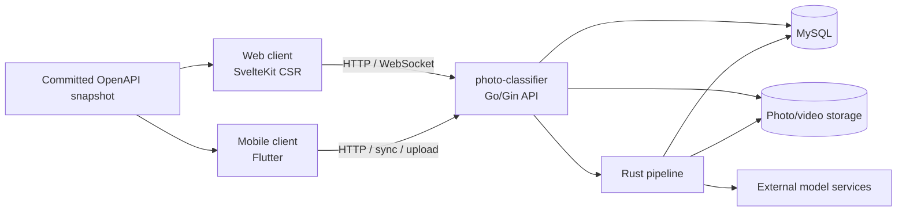
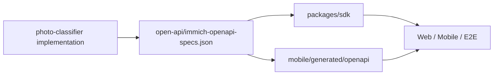

# 系统架构

> 当前仓库是客户端与契约仓库；运行时服务器位于同级 `../photo-classifier`。

## 运行拓扑

## 仓库边界

本仓库拥有：

- Web 与 Mobile UI、状态管理、本地存储和平台 integration；
- `open-api/immich-openapi-specs.json` 及生成的 TypeScript/Dart clients；
- Web unit/component tests 与 mocked-API Playwright tests；
- 独立的 legacy-compatible Machine Learning package。

`photo-classifier` 拥有：

- API 路由、鉴权、业务语义和兼容行为；
- MySQL schema、migration 和数据一致性；
- 上传、媒体读取、回收站、后台任务和部署；
- Rust pipeline 与外部 CLIP/Face/Text model service integration。

## 开发时连接

Web Vite 将 `/api`、`/.well-known/immich` 和 `/custom.css` 代理到 `IMMICH_SERVER_URL`。默认值是 `http://127.0.0.1:8080`，对应 `photo-classifier` 的默认 Go server 端口。Mobile 由用户配置 server endpoint。

## API 契约流

OpenAPI snapshot 是本仓库生成流程的输入，不再由本地 Server controller/DTO 自动同步。更新 snapshot 前应确认外部实现已经支持对应语义。

## Machine Learning 边界

`machine-learning/` 仍可独立构建和测试，但当前 `photo-classifier` runtime 使用其自身配置的外部模型服务，不依赖本目录。任何重新接入都必须作为显式跨仓库设计变更处理。

## 相关文档

- [外部服务器模块](modules/external-server.md)
- [模块地图](module-map.md)
- [开发指南](development-guide.md)
- [ADR-0001](decisions/0001-external-photo-classifier-server.md)
