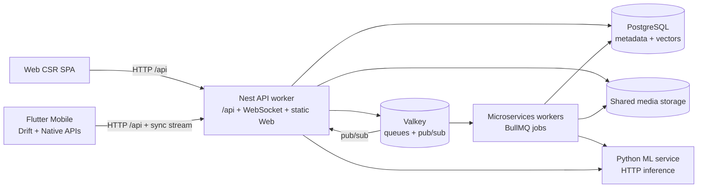
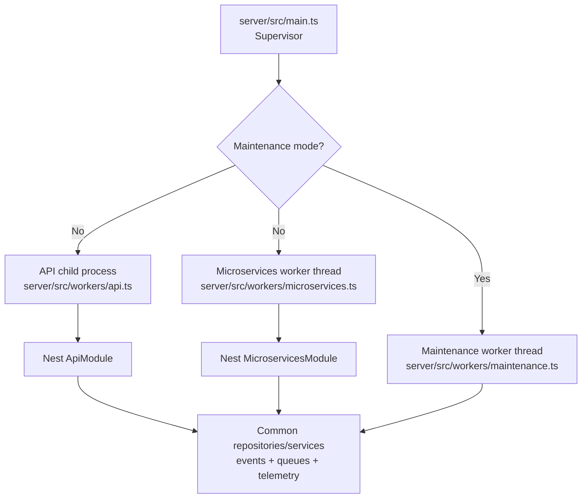
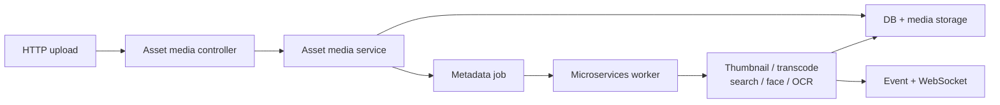
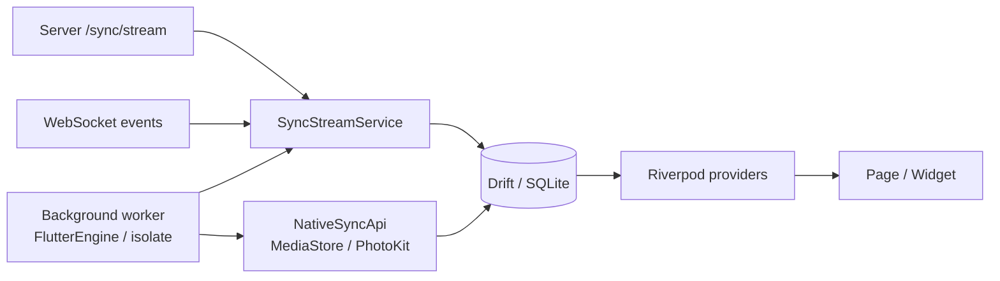
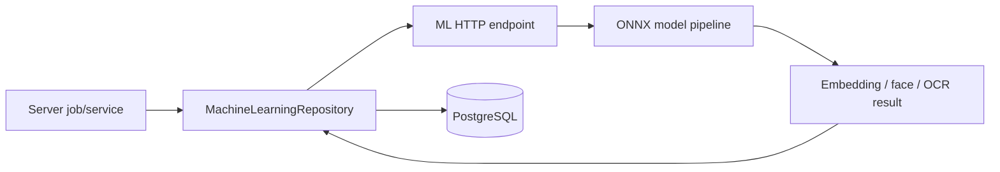

# 系统架构

> 用途：说明 Immich 的运行组件、进程模型、持久化边界和跨模块数据流。  
> 权威来源：`server/src/`、`web/src/`、`mobile/lib/`、`machine-learning/`、`docker/docker-compose.yml`。  
> 更新触发：运行组件、Server worker、queue、同步协议、持久化、WebSocket 或 ML 调用边界变化。

## 系统上下文

Immich 由两个用户客户端、一个 Server runtime、一个独立 Machine Learning 服务及共享基础设施组成：

- Web 是 SvelteKit CSR SPA，构建产物由 Nest Server 以静态资源方式托管。
- Mobile 是 Flutter 应用，拥有 Drift 本地数据库、原生媒体访问与后台任务。
- Server 提供 `/api` HTTP、WebSocket、静态 Web 资源、异步任务调度和持久化协调。
- Machine Learning 是通过 HTTP 调用的独立 Python inference 服务，不在 Server 进程内运行。
- PostgreSQL 保存业务元数据、搜索向量和 ML 结果；媒体原文件位于共享文件系统。
- Valkey/Redis-compatible 服务承担 BullMQ 与多实例实时事件协调。



## 部署与运行拓扑

开发 Compose 将 Server、Machine Learning、PostgreSQL 和 Valkey 作为独立服务运行。生产镜像把 Web 静态构建复制进 Server 镜像，因此浏览器通常从同一 Server origin 获取页面和 `/api`。

横向扩展时，各 API/microservices 实例必须共享：

- 同一个 PostgreSQL；
- 同一个 Valkey/Redis-compatible 服务；
- 同一份媒体文件系统或等价共享存储；
- 一致的关键环境配置。

多实例 WebSocket 事件通过 Redis pub/sub 协调。只扩展 API 而不共享 queue、database 或 media storage 会产生不一致行为。

主要 Compose 入口见 [`docker/docker-compose.yml`](../docker/docker-compose.yml)。生产构建和 Web 嵌入见 [`server/Dockerfile`](../server/Dockerfile)。

## Server 进程模型

[`server/src/main.ts`](../server/src/main.ts) 是 supervisor。常规模式默认运行：

- API child process：启动 Nest `ApiModule`，提供 HTTP、WebSocket 和 Web 静态资源。
- microservices worker thread：启动 `MicroservicesModule`，消费 BullMQ jobs。

Maintenance mode 与常规模式互斥：进入该模式时不启动 API/microservices workers，只启动 maintenance worker 执行维护任务。

`IMMICH_WORKERS_INCLUDE`/`IMMICH_WORKERS_EXCLUDE` 可用于拆分 worker 职责，但拆分实例仍需共享基础设施。



公共 Nest 装配位于 [`server/src/app.module.ts`](../server/src/app.module.ts) 和 [`server/src/app.common.ts`](../server/src/app.common.ts)。worker 入口见 [`server/src/workers/api.ts`](../server/src/workers/api.ts) 与 [`server/src/workers/microservices.ts`](../server/src/workers/microservices.ts)。

## 资产上传与异步处理流

典型上传路径遵循 Controller → Service → Repository：

1. API controller 验证身份、请求和上传内容。
2. Asset service 将元数据写入 PostgreSQL，并协调媒体文件写入共享存储。
3. Service 投递异步 metadata job。
4. microservices worker 从 BullMQ 消费 job。
5. 后续阶段按资产类型和配置触发存储模板、缩略图、metadata、转码、智能搜索、人脸、OCR、重复检测等处理。
6. 结果写回 PostgreSQL/媒体存储，并通过事件/WebSocket 通知客户端。



相关入口：

- [`server/src/controllers/asset-media.controller.ts`](../server/src/controllers/asset-media.controller.ts)
- [`server/src/services/asset-media.service.ts`](../server/src/services/asset-media.service.ts)
- [`server/src/services/job.service.ts`](../server/src/services/job.service.ts)
- [`server/src/repositories/job.repository.ts`](../server/src/repositories/job.repository.ts)

## Web 请求与实时更新流

Web 根布局关闭 SSR；页面在浏览器初始化后运行。典型数据流为：

```text
根布局初始化 SDK fetch
  → route load 调用生成 SDK
  → PageData 传入组件
  → service/manager 执行写操作
  → event manager / WebSocket 接收变化
  → manager/store 更新 UI
```

Web 同时使用 Svelte runes manager、writable store 和持久化 store。修改状态时应遵循相邻领域的所有权方式，而不是假定存在统一 query cache。

主要入口：

- [`web/src/routes/+layout.ts`](../web/src/routes/+layout.ts)
- [`web/src/routes/+layout.svelte`](../web/src/routes/+layout.svelte)
- [`web/src/lib/utils/server.ts`](../web/src/lib/utils/server.ts)
- [`web/src/lib/managers/event-manager.svelte.ts`](../web/src/lib/managers/event-manager.svelte.ts)
- [`web/src/lib/stores/websocket.ts`](../web/src/lib/stores/websocket.ts)
- [`packages/sdk/src/index.ts`](../packages/sdk/src/index.ts)

## Mobile 本地与远端同步流

Mobile 同时维护远端服务状态和本机媒体状态：

- 远端同步通过 `/sync/stream` 获取 JSON Lines，按实体类型批量写入 Drift 并发送 acknowledgement。
- WebSocket 事件触发增量更新或重新同步。
- 本机同步通过 Pigeon `NativeSyncApi` 调用 Android MediaStore 或 iOS PhotoKit，读取全量或 delta 变化并写入 Drift。
- 前后台生命周期会创建独立 isolate/FlutterEngine；它们共享本地数据库与部分持久状态，需要显式取消和清理。



主要入口：

- [`mobile/lib/main.dart`](../mobile/lib/main.dart)
- [`mobile/lib/utils/bootstrap.dart`](../mobile/lib/utils/bootstrap.dart)
- [`mobile/lib/domain/services/sync_stream.service.dart`](../mobile/lib/domain/services/sync_stream.service.dart)
- [`mobile/lib/domain/services/local_sync.service.dart`](../mobile/lib/domain/services/local_sync.service.dart)
- [`mobile/lib/providers/websocket.provider.dart`](../mobile/lib/providers/websocket.provider.dart)
- [`mobile/pigeon/native_sync_api.dart`](../mobile/pigeon/native_sync_api.dart)

## Machine Learning 调用流

Server 通过 Machine Learning repository 向配置的 ML URL 发起 HTTP inference 请求。服务端负责选择可用地址、序列化输入、处理响应，并将生成的搜索、人脸或 OCR 结果写回 PostgreSQL。



多个 ML URL 是按健康状态进行回退，而不是隐含的负载均衡。Remote deployment 的认证、媒体数据与可信网络边界见 [Machine Learning 安全与部署约束](modules/machine-learning.md#安全与部署约束)。

相关入口：

- [`server/src/repositories/machine-learning.repository.ts`](../server/src/repositories/machine-learning.repository.ts)
- [`server/src/services/smart-info.service.ts`](../server/src/services/smart-info.service.ts)
- [`machine-learning/immich_ml/main.py`](../machine-learning/immich_ml/main.py)

## 持久化与共享基础设施

| 数据                             | 主要位置                     | 说明                               |
| -------------------------------- | ---------------------------- | ---------------------------------- |
| 用户、资产、相册、共享、job 状态 | PostgreSQL                   | Server schema 是业务持久化权威来源 |
| 向量、人脸、OCR 等 ML 结果       | PostgreSQL                   | 由 ML 计算，最终由 Server 持久化   |
| 原始媒体与派生文件               | 共享媒体文件系统             | 数据库备份不包含媒体文件本体       |
| Queue、分布式事件、临时状态      | Valkey/Redis-compatible 服务 | BullMQ 与多实例 WebSocket 协调     |
| Mobile 本地状态                  | Drift/SQLite                 | 与远端和本机媒体源同步             |
| ML models/cache                  | Machine Learning 服务存储    | 与业务 PostgreSQL 分离             |

数据库启动与 schema 检查见 [`server/src/services/database.service.ts`](../server/src/services/database.service.ts)。媒体挂载检查见 [`server/src/services/storage.service.ts`](../server/src/services/storage.service.ts)。

## 扩展与故障边界

- API 与 microservices 可以拆分扩展，但必须保持 database、queue 和 media storage 一致。
- ML 服务不可用时，依赖 ML 的 job 会失败或重试；核心媒体保存不应与 inference 运行在同一事务边界。
- Queue backlog 会延迟派生数据和实时通知，但原始上传可能已经成功。
- WebSocket 是增量体验，不是业务数据唯一来源；客户端需要能够重新加载或重新同步。
- Mobile background worker 可能被 OS 终止；同步必须可恢复且避免重复破坏数据。
- 媒体存储和 PostgreSQL 需要独立备份策略。

## 源码导航

| 主题                     | 入口                                                                                                                  |
| ------------------------ | --------------------------------------------------------------------------------------------------------------------- |
| Server supervisor        | [`server/src/main.ts`](../server/src/main.ts)                                                                         |
| API/microservices worker | [`server/src/workers/`](../server/src/workers/)                                                                       |
| Nest composition         | [`server/src/app.module.ts`](../server/src/app.module.ts)                                                             |
| Queue handlers           | [`server/src/repositories/job.repository.ts`](../server/src/repositories/job.repository.ts)                           |
| WebSocket                | [`server/src/repositories/websocket.repository.ts`](../server/src/repositories/websocket.repository.ts)               |
| ML integration           | [`server/src/repositories/machine-learning.repository.ts`](../server/src/repositories/machine-learning.repository.ts) |
| Web root                 | [`web/src/routes/+layout.ts`](../web/src/routes/+layout.ts)                                                           |
| Mobile sync              | [`mobile/lib/domain/services/sync_stream.service.dart`](../mobile/lib/domain/services/sync_stream.service.dart)       |
| Local media sync         | [`mobile/lib/domain/services/local_sync.service.dart`](../mobile/lib/domain/services/local_sync.service.dart)         |
| Compose topology         | [`docker/docker-compose.yml`](../docker/docker-compose.yml)                                                           |
