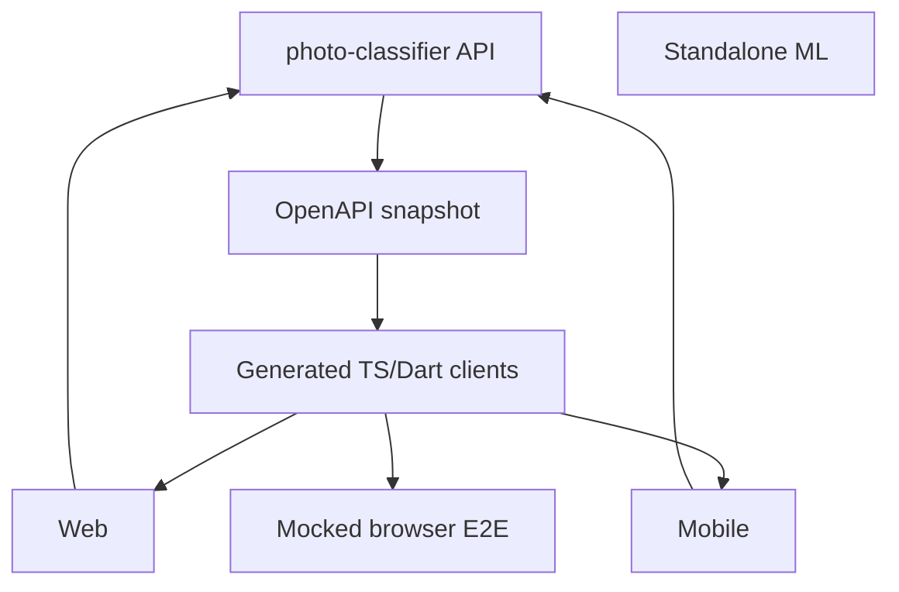

# 模块地图

## 一级目录

| 路径                | 职责                                                |
| ------------------- | --------------------------------------------------- |
| `web/`              | SvelteKit CSR Web client                            |
| `mobile/`           | Flutter client、Drift、本机媒体和原生 integration   |
| `machine-learning/` | 独立 Python inference service；当前 runtime 未接入  |
| `packages/`         | TypeScript SDK、CLI、plugin packages 与共享 scripts |
| `open-api/`         | 提交的 OpenAPI snapshot、生成模板与 patch           |
| `e2e/`              | mocked-API Playwright browser tests                 |
| `i18n/`             | Web/Mobile 共享翻译源                               |
| `docs/`             | 公开英文 Docusaurus 文档                            |
| `engineering/`      | 中文内部工程知识与 ADR                              |
| `deployment/`       | 独立基础设施配置；不包含已移除服务器的 Compose      |
| `.github/`          | 客户端、ML、文档和发布自动化                        |

仓库中不再存在 `server/`、`docker/` 或 `.devcontainer/`。服务器仓库位于 `../photo-classifier`。

## 依赖方向

`machine-learning/` 没有指向当前服务器的运行时依赖边。`packages/cli/` 是 API client，可以保留。

## 生成代码

- `packages/sdk/src/fetch-client.ts`：由 OpenAPI snapshot 生成。
- `mobile/generated/openapi/`：由 OpenAPI snapshot 生成。
- Mobile Drift、Pigeon、translation、icon 和 splash artifacts：由 Mobile tasks 生成。

生成输出不得手工编辑。API 变化的 owner 是外部服务器；本仓库只同步 snapshot 和 consumers。

## 测试归属

| 位置                                       | 范围                                                  |
| ------------------------------------------ | ----------------------------------------------------- |
| `web/src/**/*.{test,spec}.*`               | Web unit/component behavior                           |
| `mobile/test/`、`mobile/integration_test/` | Mobile unit、migration、integration                   |
| `machine-learning/test_main.py`            | 独立 ML service                                       |
| `e2e/src/ui/`                              | Vite + mocked API browser flows                       |
| `../photo-classifier`                      | 真实 API、database、upload、pipeline 与 compatibility |

## 变更路由

- API/鉴权/数据库/上传/任务：改 `../photo-classifier`。
- Web 展示与浏览器行为：改 `web/`，必要时补 `e2e/src/ui/`。
- Mobile、同步或本地数据库：改 `mobile/`。
- 客户端 contract：更新 `open-api/`，再生成 SDK。
- 当前生产模型调用：改 `../photo-classifier` 的 model service integration，而不是默认修改本仓库 `machine-learning/`。
