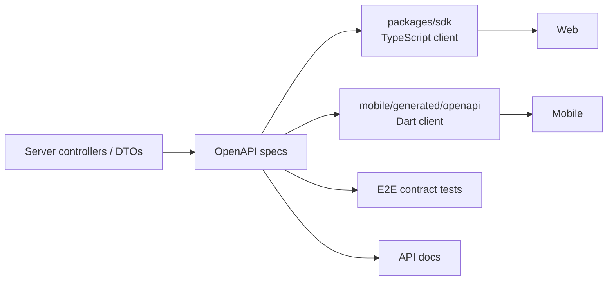
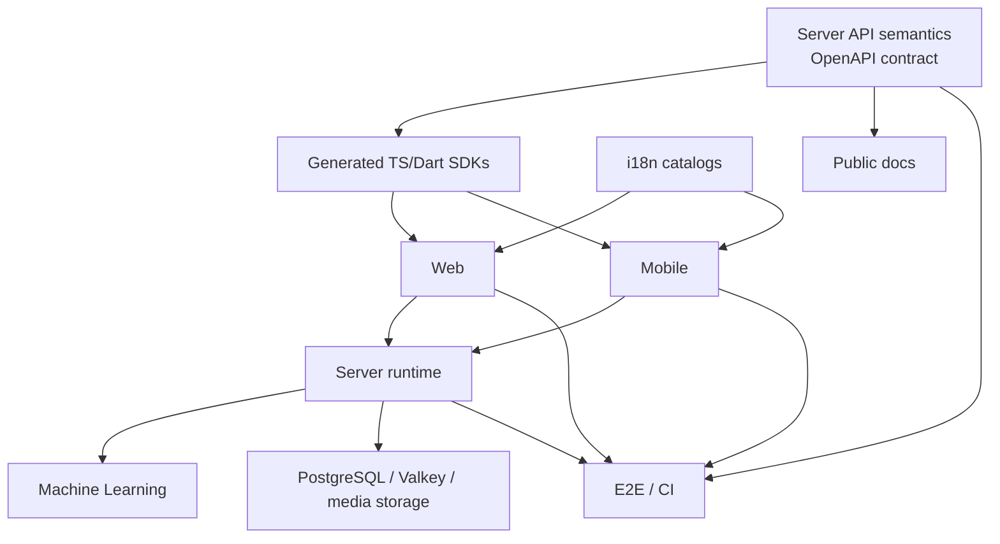

# 模块地图

> 用途：说明仓库一级目录职责、依赖方向和常见变更的联动范围。  
> 权威来源：根 `package.json`/`mise.toml`、各模块 manifest、源码入口和 `.github/workflows/`。  
> 更新触发：新增/删除/重命名一级目录，package ownership、生成目录、CI 或跨模块依赖变化。

## 一级目录概览

| 路径                  | 主要职责                                                                    |
| --------------------- | --------------------------------------------------------------------------- |
| `server/`             | NestJS API、worker、业务服务、repository、database schema、queue、WebSocket |
| `web/`                | SvelteKit CSR Web client、组件、route、manager/store、service worker        |
| `mobile/`             | Flutter app、Drift、本机/远端同步、Android/iOS 原生与后台任务               |
| `machine-learning/`   | Python HTTP inference 服务、model pipeline、cache 与 ML tests               |
| `packages/`           | TypeScript SDK、CLI、plugin packages、共享 scripts 与 E2E auth helper       |
| `open-api/`           | OpenAPI specs、生成脚本、SDK patches 与 compatibility checks                |
| `e2e/`                | API Vitest E2E、Playwright browser tests、测试环境装配                      |
| `i18n/`               | 共享 translation catalogs 与格式化工具                                      |
| `docs/`               | 公开英文 Docusaurus 文档、API 文档资源与站点配置                            |
| `engineering/`        | 中文内部工程知识与 ADR；不进入公开 Docusaurus 内容                          |
| `docker/`             | 本地/生产 Compose、image entrypoints、示例环境配置                          |
| `deployment/`         | Terraform/Terragrunt 等部署基础设施配置                                     |
| `.github/`            | CI workflows、templates、自动化与 repository policy                         |
| `fastlane/`           | 移动端 release/metadata automation                                          |
| `design/`             | 品牌 logo、截图和静态设计资产                                               |
| `mobile/packages/ui/` | Mobile 独立 Flutter UI package                                              |
| `readme_i18n/`        | README 翻译内容                                                             |
| `misc/`               | 不属于运行时模块的辅助资源                                                  |

`node_modules/`、build、coverage、Mobile generated output 等是本地产物，不是架构模块。

## 运行时模块

### Server

`server/` 同时包含 API 和 microservices worker 的实现。HTTP 入口、domain orchestration、persistence adapter 和 background jobs 在同一 TypeScript package 内，但通过 controller/service/repository/schema/worker 职责分离。

详见 [Server 模块](modules/server.md)。

### Web

`web/` 是浏览器端 CSR SPA。生产构建进入 Server image；开发时 Vite 将 API 请求代理到 Server。Web 通过生成的 TypeScript SDK 消费 API contract。

详见 [Web 模块](modules/web.md)。

### Mobile

`mobile/` 是独立 Flutter application，包含 Dart domain/infrastructure/presentation、Drift、本机媒体访问和 Android/iOS native code。它通过生成的 Dart OpenAPI client 和 sync stream 与 Server 交互。

详见 [Mobile 模块](modules/mobile.md)。

### Machine Learning

`machine-learning/` 是 Server 通过 HTTP 调用的独立 Python 服务，负责 embeddings、人脸和 OCR 等 inference。它不直接拥有业务数据库。

详见 [Machine Learning 模块](modules/machine-learning.md)。

## 契约与生成代码

API contract 的联动链路是：

生成输出不能手改。Server contract 变化需要检查 `open-api/`、`packages/sdk/`、`mobile/generated/openapi/`、Web/Mobile consumers、E2E 和 API docs。

Mobile 还有独立生成链路：

- Drift schema/code generation；
- Pigeon Dart/Swift/Kotlin interfaces；
- localization resources；
- app icon/splash assets。

详见 [Contracts 与 Packages](modules/contracts-and-packages.md) 与 [开发指南](development-guide.md)。

## 共享 packages

`packages/` 不是单一运行时模块：

- `packages/sdk/`：Web 和外部 TypeScript consumers 使用的生成 API client 与 helper。
- `packages/cli/`：Immich CLI。
- `packages/plugin-core/`、`packages/plugin-sdk/`：plugin contract 与开发接口。
- `packages/scripts/`：repository automation helpers。
- `packages/e2e-auth-server/`：E2E authentication support。

Web 的 `@immich/ui` 是 package dependency；Mobile 的 UI package 位于 `mobile/packages/ui/`。根 `design/` 是静态品牌资产，不是 executable UI package。

## 测试与质量工具

| 位置                                        | 主要工具/范围                                          |
| ------------------------------------------- | ------------------------------------------------------ |
| `server/test/` 与 `server/src/**/*.spec.ts` | Vitest unit、Testcontainers/PostgreSQL medium tests    |
| `web/src/**/*.{test,spec}.*`                | Vitest、happy-dom、Testing Library                     |
| `mobile/test/`、`mobile/integration_test/`  | Flutter unit/medium/presentation/migration/integration |
| `machine-learning/test_main.py`             | pytest、model/service behavior                         |
| `e2e/`                                      | API Vitest、Playwright Web/UI/maintenance projects     |
| `.github/workflows/`                        | CI job composition 与 enforced gates                   |

测试选择由 [测试指南](testing-guide.md) 统一说明；模块文档只记录模块特有风险。

## 文档与本地化

- `docs/docs/` 是公开英文站点内容。
- `engineering/` 是内部中文工程知识。
- `i18n/` 是应用 translation catalog，不等于 Docusaurus localization。
- `readme_i18n/` 保存 README translations。
- API docs 会消费 OpenAPI output，contract 变化可能影响站点构建内容。

公开文档修改遵循 [`docs/AGENTS.md`](../docs/AGENTS.md)；内部文档维护遵循 [维护指南](maintenance-guide.md)。

## 基础设施与发布

- `docker/` 定义本地/生产容器拓扑和示例配置。
- `server/Dockerfile` 构建 Server、Web 静态资源与 production image。
- `deployment/` 保存 Terraform/Terragrunt infrastructure code。
- `fastlane/` 与 Mobile platform 配置共同支持 release automation。
- `.github/workflows/` 组合 static analysis、unit、medium、E2E、build 与 release jobs。

详见 [Infrastructure 与 Tooling](modules/infrastructure-and-tooling.md)。

## 依赖方向

关键原则：

- Client 不直接访问 PostgreSQL、Valkey 或 media storage。
- ML 不直接成为业务数据库 owner；Server 负责业务持久化。
- 生成 SDK 依赖 API contract，不能反向定义 Server behavior。
- CI 验证实现和 contract，但不是 runtime dependency。
- 内部工程文档解释依赖，不参与 build/runtime。

## 变更影响矩阵

| 变更                               | 主要 owner                                 | 必查联动                                                                         |
| ---------------------------------- | ------------------------------------------ | -------------------------------------------------------------------------------- |
| Server controller/DTO/API behavior | `server/`                                  | OpenAPI、TS/Dart SDK、Web/Mobile consumers、E2E、API docs                        |
| Database schema/function/trigger   | `server/src/schema/`                       | migration、medium tests、backup/upgrade compatibility                            |
| Queue/job contract                 | Server services/repositories               | producer、唯一 handler、worker deployment、job tests                             |
| Web route/component/state          | `web/`                                     | generated SDK usage、shared-link auth、Vitest、Playwright when user flow changes |
| Mobile Drift entity/schema         | Mobile infrastructure                      | generated Drift code、saved schema、migration tests、sync mapping                |
| Mobile native/Pigeon API           | `mobile/pigeon/` + native code             | Dart/Swift/Kotlin generation、Android/iOS implementations、integration tests     |
| ML endpoint/request/result         | `machine-learning/` + Server ML repository | Python tests、Server compatibility、job behavior、deployment/security            |
| Translation key/catalog            | `i18n/`                                    | Web typed keys/loaders、Mobile generated localization、format checks             |
| OpenAPI generator/patch            | `open-api/`                                | specs、both SDKs、patch coverage、consumer builds/tests                          |
| Docker/Compose/storage layout      | `docker/` + Server config                  | environment docs、mount integrity、upgrade/deployment behavior                   |
| CI task/workflow                   | `.github/workflows/` + task owner          | local task documentation、required tools、cache/artifact expectations            |
| Public docs/MDX/navigation         | `docs/`                                    | format; build when MDX/config/navigation/generated API content changes           |
| Internal engineering docs          | `engineering/`                             | Prettier、relative links、documented task names、owner consistency               |
