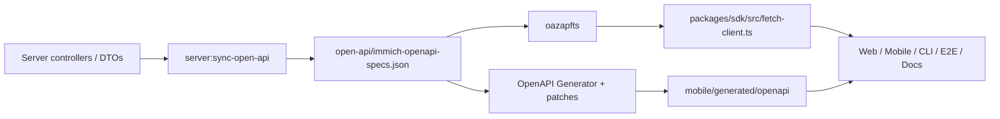

# Contracts 与 Packages

> 用途：说明 OpenAPI contract、生成 SDK、CLI、plugin、共享 package、UI/设计资源和 i18n 的边界。  
> 权威来源：`mise.toml`、`open-api/`、`packages/`、`mobile/generated/openapi/`、`i18n/` 与相关 manifests。  
> 更新触发：API generation、SDK layout、CLI/plugin contract、translation source、UI package 或 brand asset ownership 变化。

## OpenAPI ownership

API behavior 的实现 owner 是 Server controller/service/DTO。OpenAPI generation 将实现 contract 同步到 machine-readable spec，再生成 clients。

关键规则：

- 不通过手改 spec/client 来掩盖 Server contract 问题。
- 生成 diff 是 API 变更的一部分，必须审查 breaking shape、nullable/default、enum 和 auth metadata。
- SDK 编译通过不等于 consumer behavior 已验证；Web/Mobile/E2E 仍需按影响运行测试。
- API docs 也消费 spec，contract 变化可能影响 Docusaurus build。

## TypeScript SDK

[`packages/sdk/src/fetch-client.ts`](../../packages/sdk/src/fetch-client.ts) 由 oazapfts 生成，包含 schema、endpoint 和 request helpers。禁止手改。

[`packages/sdk/src/index.ts`](../../packages/sdk/src/index.ts) 是手写 wrapper，负责：

- SDK initialization；
- base URL；
- API key/custom headers；
- media URL helpers；
- Web-compatible fetch injection。

如果需求属于所有 TypeScript consumers 的稳定 helper，可以修改 wrapper；如果属于某个 Web feature，保持在 Web service/manager。

生成入口：

- `mise //:open-api-typescript`
- `mise //:sdk:build`
- 完整 contract：`mise //:open-api`

## Dart SDK

`mobile/generated/openapi/` 是本地生成且被忽略的目录，由 [`open-api/bin/generate-dart-sdk.sh`](../../open-api/bin/generate-dart-sdk.sh) 重建。生成流程使用 templates、patches 和 OpenAPI Generator。

关键规则：

- 不在 generated directory 内保留手工修复；下一次 generation 会删除并重建。
- 必要兼容修复应进入 `open-api/patch/`、template 或 generator script。
- patch coverage 需要通过专门测试确认，避免上游 generator 输出变化后静默失效。
- 生成后检查 Mobile compile、mapping 与 sync contract。

生成入口：

- `mise //:open-api-dart`
- 完整 contract：`mise //:open-api`

## CLI

[`packages/cli/`](../../packages/cli/) 是独立 TypeScript package，通过 SDK/API 完成命令行操作。它不是 Server runtime 的子模块。

CLI 变化需要区分：

- command parsing/UX；
- SDK/API behavior；
- filesystem/upload/download behavior；
- authentication/config；
- package build/publish。

常用入口：

- `mise //packages/cli:test`
- `mise //packages/cli:check`
- `mise //packages/cli:checklist`

如果 API contract 变化影响 CLI，先重新生成/构建 SDK，再修改 CLI consumer。

## Plugin core 与 SDK

[`packages/plugin-core/`](../../packages/plugin-core/) 和 [`packages/plugin-sdk/`](../../packages/plugin-sdk/) 定义 plugin contract、host interaction 和开发接口。Server workflow execution 通过 Extism/WASM 使用这些 contract。

修改 plugin interface 时检查：

- plugin-core serialization/ABI；
- plugin-sdk public API；
- root `mise //:plugins` build；
- Server workflow execution；
- compatibility/versioning；
- sandbox/resource limits。

不要把普通 Server internal type 直接暴露为 plugin ABI；稳定 contract 需要显式兼容设计。

## 其他 packages

| 路径                                                           | 职责                                                 |
| -------------------------------------------------------------- | ---------------------------------------------------- |
| [`packages/scripts/`](../../packages/scripts/)                 | release、repository automation 与内部 CLI helpers    |
| [`packages/e2e-auth-server/`](../../packages/e2e-auth-server/) | E2E authentication test support                      |
| [`mobile/packages/ui/`](../../mobile/packages/ui/)             | 独立 Flutter UI package，需单独 test                 |
| Web `@immich/ui`                                               | 外部 package dependency，不在本仓库维护其完整 source |
| [`design/`](../../design/)                                     | logo、截图和品牌静态资产，不是 executable package    |

这些内容放在同一文档是为了导航，不代表共享 runtime、release cadence 或 test command。

## i18n

根 [`i18n/`](../../i18n/) 是应用 translation catalog。Web 和 Mobile 使用不同加载/生成方式消费同一来源：

- Web lazy-loads catalogs，并从英文 catalog 派生 type-safe keys；
- Mobile 生成 loader/keys/resources；
- formatting task 保证 JSON 结构与排序；
- locale alias、fallback、RTL 和 format locale 由客户端实现。

translation key 变更需检查：

1. `mise //:i18n:format` 或 format-fix flow；
2. Web type/load behavior；
3. `mise //mobile:codegen:translation`；
4. key deletion/rename 对两个客户端的影响。

不要在 generated localization 文件中直接添加 key。

## 变更联动

| 变更                       | 必查联动                                                      |
| -------------------------- | ------------------------------------------------------------- |
| Server API/DTO             | spec、TS/Dart SDK、Web/Mobile/CLI、E2E、API docs              |
| oazapfts/generator upgrade | 全量 generated diff、patch、SDK build、consumer compile       |
| TypeScript SDK wrapper     | Web/CLI/external API compatibility                            |
| Dart patch/template        | patch coverage、Mobile compile/test                           |
| Plugin ABI/API             | plugin-core、plugin-sdk、Server workflow、compatibility       |
| Translation key            | JSON format、Web typed key、Mobile generation、UI fallback    |
| Mobile UI package          | package-local tests、Mobile consumers、preview/examples       |
| Brand asset                | README/docs/release/mobile/web consumers and licensing/format |

## 最小验证入口

| 范围                     | 最小入口                            |
| ------------------------ | ----------------------------------- |
| 全量 OpenAPI + both SDKs | `mise //:open-api`                  |
| TypeScript SDK only      | `mise //:open-api-typescript`       |
| Dart SDK only            | `mise //:open-api-dart`             |
| Plugin packages          | `mise //:plugins`                   |
| CLI                      | `mise //packages/cli:checklist`     |
| Translation formatting   | `mise //:i18n:format`               |
| Mobile translations      | `mise //mobile:codegen:translation` |

根据 consumer 影响追加 Web/Mobile/Server/E2E focused tests。

## 生成文件

禁止直接编辑：

- `packages/sdk/src/fetch-client.ts`；
- `mobile/generated/openapi/`；
- generator 标记的 Dart/Pigeon/translation outputs。

允许手工维护但需谨慎：

- `packages/sdk/src/index.ts` wrapper；
- `open-api/templates/`、`open-api/patch/`、generation scripts；
- plugin public source；
- translation source catalogs。

## 源码导航

| 主题                  | 路径                                                                                                         |
| --------------------- | ------------------------------------------------------------------------------------------------------------ |
| Root generation tasks | [`mise.toml`](../../mise.toml)                                                                               |
| OpenAPI workspace     | [`open-api/`](../../open-api/)                                                                               |
| TypeScript SDK        | [`packages/sdk/`](../../packages/sdk/)                                                                       |
| CLI                   | [`packages/cli/`](../../packages/cli/)                                                                       |
| Plugin core/SDK       | [`packages/plugin-core/`](../../packages/plugin-core/)、[`packages/plugin-sdk/`](../../packages/plugin-sdk/) |
| Dart generated SDK    | `mobile/generated/openapi/`（由上方 generation script 生成）                                                 |
| i18n catalogs         | [`i18n/`](../../i18n/)                                                                                       |
| Mobile UI package     | [`mobile/packages/ui/`](../../mobile/packages/ui/)                                                           |
| Brand assets          | [`design/`](../../design/)                                                                                   |
